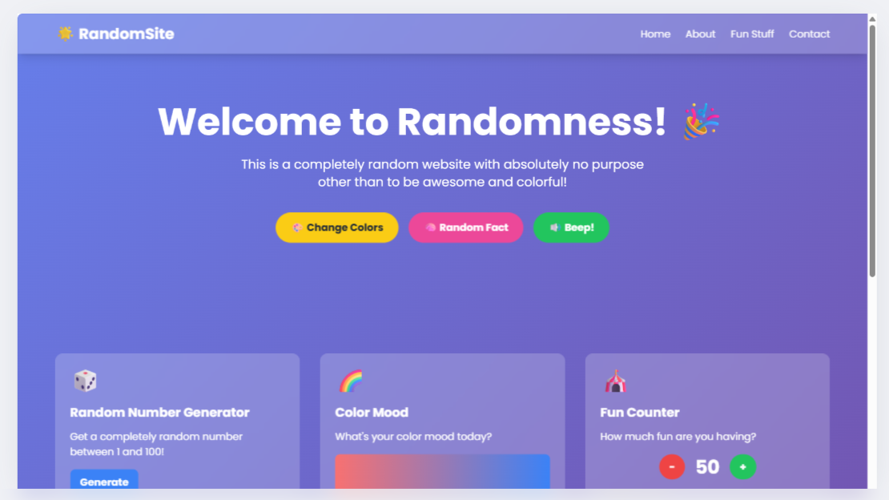
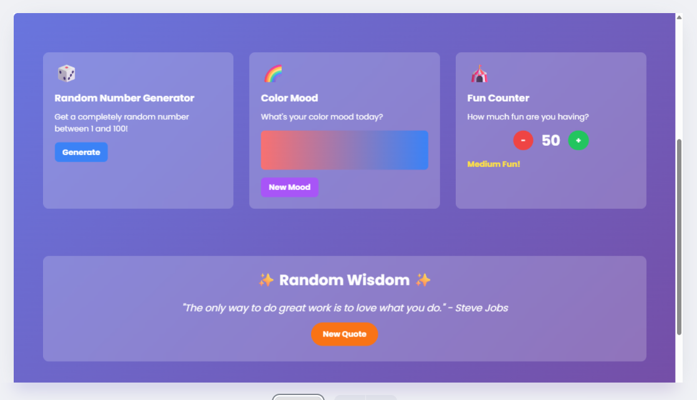
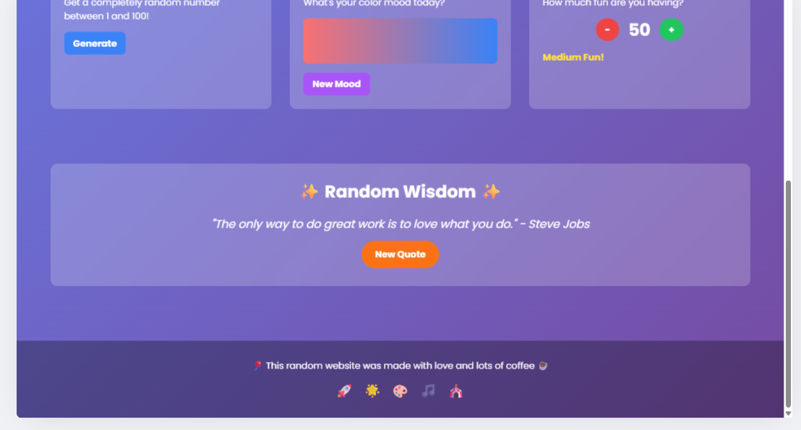
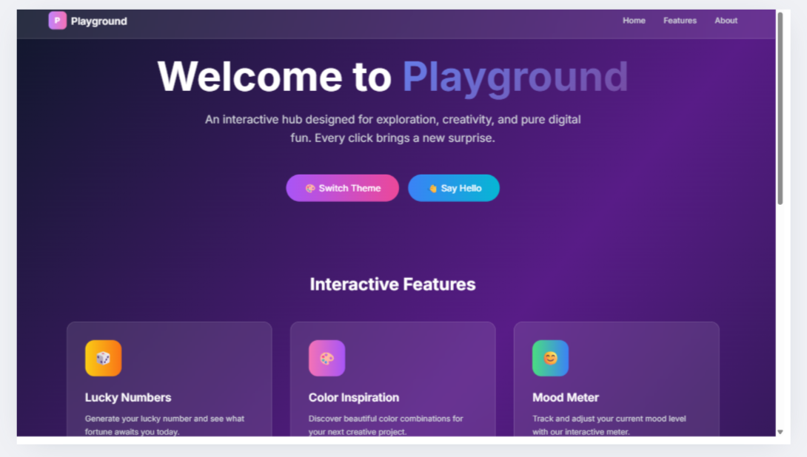
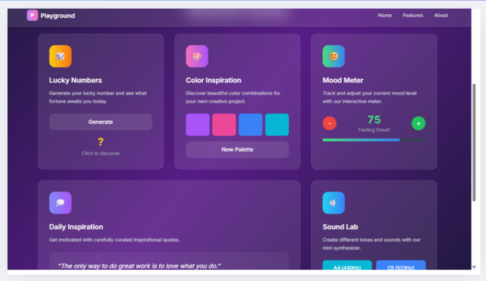
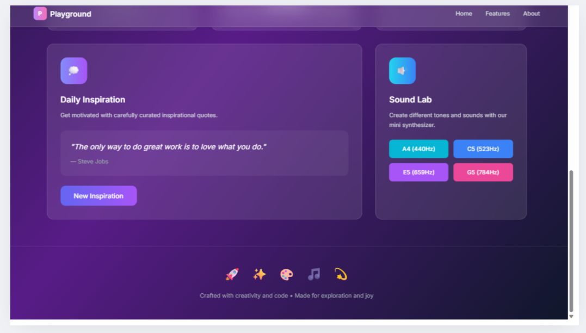

# Redesign a Website Landing Page  

## 📸 Before-and-After Visuals  

### 🔹 Before  
  
 
  

### 🔹 After  

## 🎨 Design Decisions  

The original landing page was fun and colorful but had several design limitations:  
- The **hero section** was cluttered and did not clearly highlight the core purpose.  
- **Typography and spacing** were inconsistent, making readability harder.  
- The **color palette** was vibrant but lacked balance and professional appeal.  
- Content blocks were placed without a strong **visual hierarchy**, which could confuse users.  
- Limited consideration for **responsiveness**, especially on smaller screens.  

In the redesigned version, I focused on creating a more **modern, structured, and user-friendly** experience while retaining the engaging feel of the site:  
- The **hero section** was simplified with a strong central message and clear call-to-action.  
- Applied **consistent typography, spacing, and alignment** for better readability.  
- Refined the **color scheme** to be aesthetically pleasing while keeping vibrancy for brand personality.  
- Reorganized content into clear **sections with hierarchy** (hero, features, testimonials, call-to-action, footer).  
- Ensured **responsiveness across devices** with layouts that adapt smoothly to mobile, tablet, and desktop.  

This redesign improves **visual appeal, usability, and brand consistency**, creating a landing page that is both attractive and functional.  

## 🚀 Deliverable  
This repository provides the **Before-and-After visuals** of the landing page redesign, along with a **detailed explanation of the design decisions** taken to improve aesthetics, readability, and responsiveness.  
